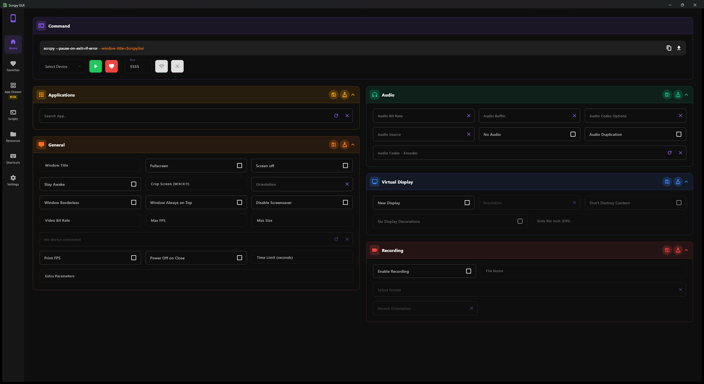
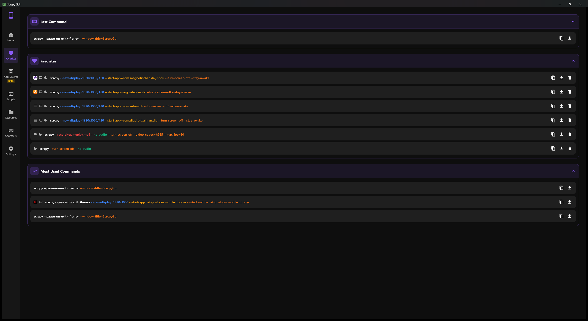
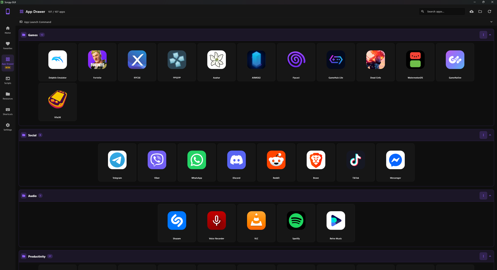
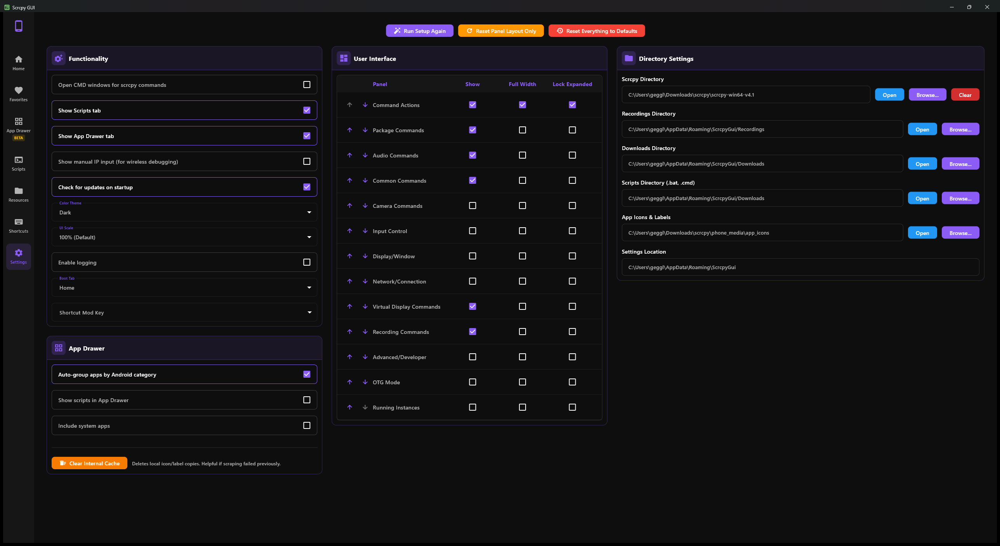
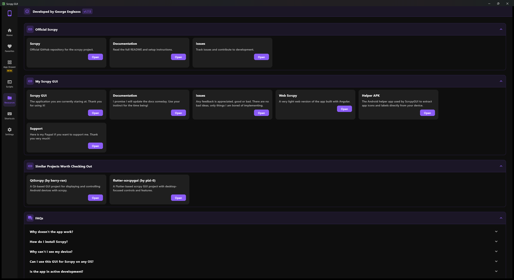
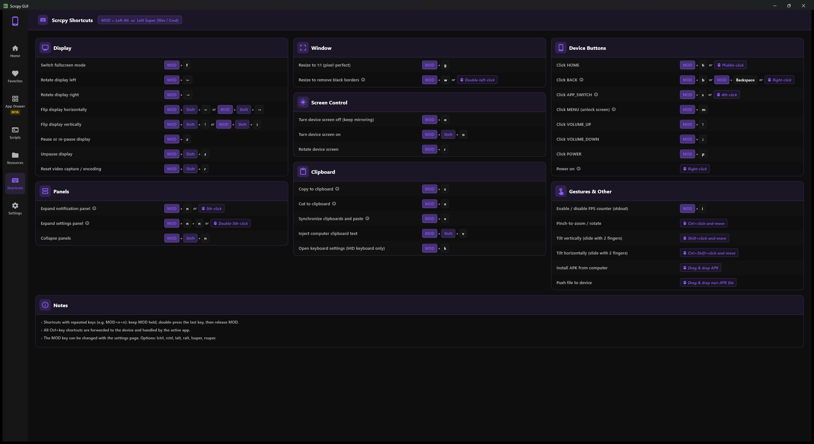
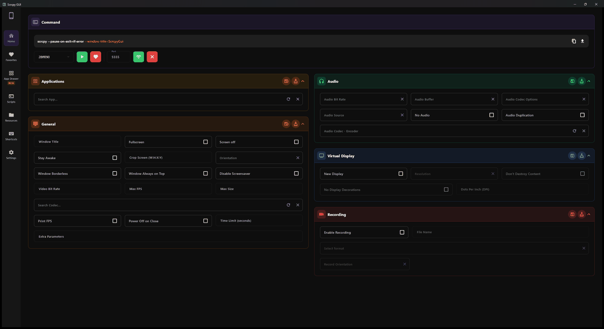

# Scrcpy GUI

[]()
[](https://github.com/microsoft/winget-pkgs/tree/master/manifests/g/GeorgeEnglezos/ScrcpyGUI)

A modern, cross-platform graphical user interface for [scrcpy](https://github.com/Genymobile/scrcpy) - the powerful Android screen mirroring and control tool.


---

## 🎯 Overview

Scrcpy GUI transforms the command-line scrcpy experience into an intuitive graphical interface, making Android device mirroring and control accessible to everyone. Built with Flutter, this application provides a seamless experience across Windows, macOS, and Linux platforms.

### What is scrcpy?

[scrcpy](https://github.com/Genymobile/scrcpy) is an open-source tool that provides display and control of Android devices connected via USB or TCP/IP. It's lightweight, high-performance, and requires no root access.

### What does Scrcpy GUI add?

- **Visual Command Builder** - Generate complex scrcpy commands without memorizing flags
- **Multi-Device Management** - Control multiple Android devices simultaneously
- **Wireless Setup** - One-click wireless connection configuration
- **Process Monitoring** - Track and manage all running scrcpy instances
- **Command Favorites** - Save and reuse your frequently used configurations
- **Real-time Preview** - See generated commands with syntax highlighting
- **Cross-Platform** - Native support for Windows, macOS, and Linux

---

## 🚀 Quick Start

### Prerequisites

1. **scrcpy** - Install from [official repository](https://github.com/Genymobile/scrcpy#get-the-app)
   - Windows: `scoop install scrcpy` or `choco install scrcpy`
   - macOS: `brew install scrcpy`
   - Linux: `sudo apt install scrcpy`

2. **ADB (Android Debug Bridge)** - Usually included with scrcpy

3. **Android Device** - With USB debugging enabled
   - Go to Settings → About Phone → Tap "Build Number" 7 times
   - Go to Settings → Developer Options → Enable "USB Debugging"

### Installation

**Windows (winget)** - the easiest way to install and stay up to date:

```
winget install GeorgeEnglezos.ScrcpyGUI
```

**Manual download** - grab the latest release for your platform from the [Releases](https://github.com/GeorgeEnglezos/Scrcpy-GUI/releases) page:

- **Windows**: `scrcpy-gui-windows-vX.X.X.zip`
- **macOS**: `scrcpy-gui-macos-vX.X.X.zip`
- **Linux**: `scrcpy-gui-linux-vX.X.X.zip`

Extract and run the executable for your platform.

### First Use

1. Connect your Android device via USB
2. Accept the USB debugging authorization prompt on your device
3. Launch Scrcpy GUI
4. Your device should appear in the dropdown within 2 seconds
5. Click **Run** to start mirroring

That's it! Your Android screen should now be mirroring on your computer.

---

## ✨ Key Features

### 🎨 Visual Command Builder

Configure all scrcpy options through an intuitive interface organized into themed panels:

- **Common Commands** - Bitrate, resolution, FPS, orientation, window options
- **Audio Commands** - Audio quality, codec selection, source configuration
- **Recording Commands** - Screen recording with format and quality controls
- **Camera Commands** - Mirror device cameras instead of screen
- **Virtual Display** - Create and manage virtual displays
- **Input Control** - Keyboard and mouse configuration
- **Network Connection** - Wireless setup and SSH tunneling
- **Advanced Options** - Developer settings and debugging tools

### 📱 Device Management

- **Automatic Detection** - Devices discovered every 2 seconds
- **USB and Wireless** - Support for both connection types
- **Multi-Device** - Control multiple devices simultaneously
- **Device Information** - Cached codecs, packages, and capabilities

### 🔄 Wireless Connection

Set up wireless mirroring with a single click:

1. Connect device via USB initially
2. Click "Connect Wirelessly"
3. Disconnect USB cable
4. Continue mirroring over WiFi

No manual ADB commands required!

### ⭐ Favorites System

- Save unlimited command configurations
- Track execution frequency with a Most Used list
- Last Command recalled instantly
- Quick access from dedicated page
- Export as executable scripts

---

## 📖 Documentation

- **[Troubleshooting](Docs/TROUBLESHOOTING.md)** - Quick fixes for common issues
- **[Codebase Reference](Docs/CODEBASE_REFERENCE.md)** - Developer documentation

---

## 🖼️ Screenshots

<div align="center">
   
   
</div>

<div align="center">
   
   
</div>

<div align="center">
   
   
</div>

---

### 🎬 In action

<div align="center">
   
   <br/><em>Toggle options and watch the scrcpy command build in real time</em>
</div>

<div align="center">
   
   <br/><em>A quick tour through the tabs</em>
</div>

---

## 💻 Platform Support

| Platform | Status | Notes |
|----------|--------|-------|
| Windows | ✅ Fully Supported | Windows 10/11 |
| macOS | ✅ Fully Supported | macOS 10.15+ (Intel & Apple Silicon) |
| Linux | ✅ Fully Supported | Ubuntu 20.04+, Debian, Fedora, Arch |

---

## 🌐 Web Version

Looking for a browser-based alternative? Check out the web companion app:

**🔗 [https://scrcpy-ui.web.app/](https://scrcpy-ui.web.app/)**

### Web App Advantages

- ✅ No installation required
- ✅ Works on any operating system
- ✅ Faster and more accessible
- ✅ Package, codec, and encoder selection

---

## 🛠️ Building from Source

Requires the [Flutter SDK](https://docs.flutter.dev/get-started/install) (Dart ^3.9.2):

```bash
cd ScrcpyGui
flutter run -d windows    # or: -d macos / -d linux
flutter build windows     # release build
```

Developer docs: [Codebase Reference](Docs/CODEBASE_REFERENCE.md)

---

## 🤝 Contributing

Contributions are welcome! Here's how you can help:

1. **Report Bugs** - Open an issue with detailed reproduction steps
2. **Suggest Features** - Share your ideas in the discussions
3. **Improve Documentation** - Help make the docs clearer
4. **Share** - Tell others about the project
5. **Donation** - Make a small donation in paypal

---

## 📞 Support

- **Issues**: [GitHub Issues](https://github.com/GeorgeEnglezos/Scrcpy-GUI/issues)
- **scrcpy Documentation**: [Official Docs](https://github.com/Genymobile/scrcpy)

---

## 🗺️ Project History

This project began as a .NET MAUI experiment to make scrcpy more user-friendly on Windows. With version 1.6, it has been completely ported in Flutter to provide true cross-platform support for Windows, macOS, and Linux.

The original .NET MAUI version (v1.5.1) has been moved to its own repository: [maui-scrcpy-gui](https://github.com/GeorgeEnglezos/maui-scrcpy-gui). It is no longer maintained.

---

<div align="center">

**Made with ❤️ for the Android enthusiast community**

[⬆ Back to Top](#scrcpy-gui)

</div>
